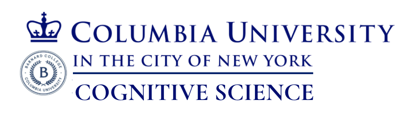

# Research Study: Mechanisms of Causal Reasoning

**By Rachel Papirmeister**

*Research conducted under the supervision of Professor Mark Santolucito, Ph.D.*

 

Neurosymbolic approaches to artificial intelligence (AI) move beyond traditional deep learning by integrating neural networks and symbolic systems, yielding enhancements in the interpretability, robustness, and efficiency of AI. This hybrid paradigm enables models to not only recognize patterns, but also manipulate abstract rules and reason over novel combinations of learned concepts, more closely mirroring the flexibility of human cognition. Although neurosymbolic AI appears to outperform earlier machine learning approaches, and multi-level optimization and agentic reasoning paradigms (such as ReAct's *think-act-observe* loop) have achieved remarkable performance across many domains, AI systems overall continue to struggle in areas where human cognition excels: causal inference tasks, generalization from sparse data, and flexible problem-solving in novel environments. To investigate these disparities, I developed three original, instructionless grid-games with four to five levels each, wherein 100+ participants solve puzzles through real-time hypothesis testing and environment-driven exploration. Multimodal data was collected while participants navigated the puzzles; their verbal reasoning traces were elicited using a think-aloud protocol while quantitative data was automatically obtained, including eye-tracking, keystroke logs, timestamps, and game states of each participant. Data was evaluated using a three-pronged analytical approach; first through grounded theory analysis, verbal learning markers were tracked across concurrent trajectories of mechanic-based and objective-based exploration, and then classified into a taxonomy of knowledge acquisition using natural language processing for feature extraction. Subsequent mixed-effects regression analysis was used to determine whether relative puzzle performance could be predicted from verbal reasoning traces, and this same human data laid the foundation for a novel architecture: a deterministic finite automaton (DFA) that governs the sequence of knowledge acquisition in an LLM. Preliminary findings support a proposed update to the traditional explore-exploit framework by introducing a third, intermediary mechanism, ‘establish’, which encompasses the hypothesis-testing and confirmatory behaviors that bridge exploration and exploitation in human learning specifically from sparse data. The puzzle performance of an LLM governed by a 3-state DFA (explore/establish/exploit) was compared to performance of an LLM with no DFA equipped; the DFA-augmented LLM showed improved performance on pre-existing puzzle benchmarks, particularly in problem spaces with sparce reward. Full results will be reported in the final paper, anticipated May 2026.

 

*My broader objective is to leverage this insight in constructing domain-specific machine learning architectures specialized for few-shot learning and long-horizon planning, with implications for the design of human-centric, neurosymbolic systems and improving world models.*

### For research inquiries, please email r.papirmeister@columbia.edu.
